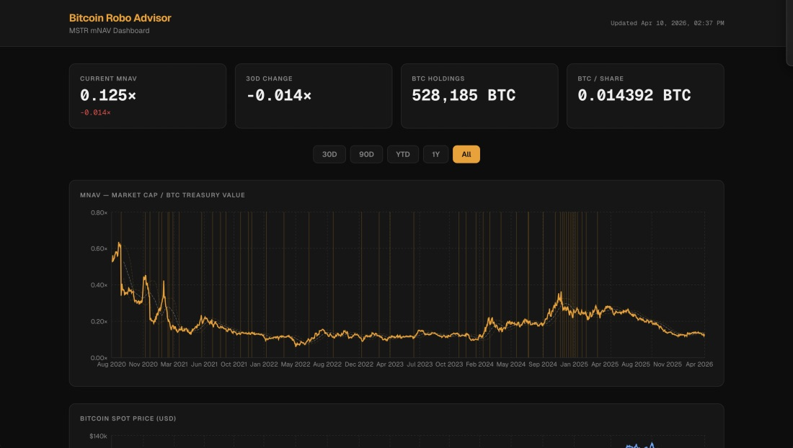

# DAT Radar



A Next.js dashboard and B2B data service that tracks **MSTR mNAV** — the market's implied multiple on MicroStrategy's Bitcoin treasury.

**mNAV = Market Cap / (BTC Holdings × BTC Spot Price)**

A value above 1.0 means the market prices MSTR at a premium to the mark-to-market value of its disclosed Bitcoin stack (at spot). A reference line at 1× is drawn on the chart.

## Stack

- [Next.js](https://nextjs.org/) (App Router), React 19, TypeScript
- [Tailwind CSS](https://tailwindcss.com/) v4
- [Recharts](https://recharts.org/) for charts
- [OpenAI](https://platform.openai.com/) (`gpt-4o-mini`) for optional narrative insight

## Features

- **mNAV series** with 30-day rolling average, ±1 standard deviation band, and vertical markers on treasury disclosure dates
- **BTC spot (USD)** line chart on the same calendar axis (via `BTC-USD` daily data)
- **Four KPI tiles**: current mNAV (with 30-day delta), 30-day mNAV change, BTC holdings, BTC per share
- **Date range**: 30D / 90D / YTD / 1Y / All (default **1Y**)
- **AI insight** panel: POSTs a derived stats payload to `/api/ai-insight`; responses are cached in memory per identical payload until the server restarts
- **B2B API**: `GET /api/v1/mnav/MSTR?range=90d` with `X-API-Key`
- **Embeddable widget**: `/embed/MSTR?range=1y&theme=dark`
- **Partner demo page**: `/demo`
- Loading, error, and retry handling for market data fetches

## Data sources

| Data | Source |
|------|--------|
| MSTR daily price | Yahoo Finance (`yahoo-finance2`, ticker `MSTR`) |
| BTC daily spot (USD) | Yahoo Finance (`yahoo-finance2`, ticker `BTC-USD`) |
| MSTR BTC holdings | SEC EDGAR — live-parsed from 8-K filings via `lib/fetch-holdings.ts` |
| MSTR shares outstanding | Yahoo Finance (`quoteSummary` / `defaultKeyStatistics`) |

Holdings are **forward-filled** from the latest entry on or before each trading day.

### Live holdings pipeline

On each cold-cache start `lib/fetch-holdings.ts`:

1. Loads `data/holdings.json` as the historical baseline (entries through 2025-03-31).
2. Fetches `https://data.sec.gov/submissions/CIK0001050446.json` (SEC EDGAR) to get all 8-K filings filed after the last static entry.
3. For each new `mstr-*.htm` 8-K, fetches the primary document and parses the **Aggregate BTC Holdings** value. Three confirmed filing formats are handled:
   - **Table format** (2025-present weekly purchase 8-Ks, primary doc): `{acquired} $ {price_m} $ {avg_price} {holdings} $ {total_b} $ {avg_cost}`
   - **Narrative format** (quarterly earnings exhibit `mstr-ex99_1.htm`): `{holdings} bitcoin holdings at a total cost of $X billion`
   - **Legacy narrative** (pre-2025): `aggregate of X bitcoin`
4. Fetches current `sharesOutstanding` from Yahoo Finance and applies it to all new entries.
5. Merges new entries with the static baseline and caches the result in memory for **24 hours**.
6. Falls back to the static JSON if either EDGAR or Yahoo Finance is unreachable.

EDGAR requests are spaced at ≥ 120 ms apart to stay within the 10 req/s fair-use limit.

## Getting started

### 1. Install dependencies

```bash
npm install
```

### 2. Environment variables

```bash
cp .env.example .env.local
```

Set `OPENAI_API_KEY` in `.env.local` (next to `package.json`). The dashboard loads without it, but **AI insight** returns an error until the key is set and the dev server is restarted.

### 3. Run locally

```bash
npm run dev
```

Open [http://localhost:3000](http://localhost:3000).

Other scripts: `npm run build`, `npm run start`, `npm run lint`.

## API routes

- `GET /api/market-data?range=30d|90d|ytd|1y|all` — merged prices, mNAV series, rolling metrics, KPIs (`Cache-Control: no-store`)
- `POST /api/ai-insight` — body must match the validated `InsightPayload` shape (see `types/index.ts` and `lib/build-prompt.ts`)

## Deployment (Vercel)

1. Push this directory to a GitHub repository.
2. Import the repo at [vercel.com/new](https://vercel.com/new).
3. Under **Environment Variables**, add `OPENAI_API_KEY`.
4. Deploy.

## Holdings data

`data/holdings.json` is the historical baseline used before the live pipeline was added. It covers entries through **2025-03-31** and is still required as the starting point for forward-fill.

Any new 8-K filings after that date are fetched automatically from EDGAR at runtime — **no manual updates to `data/holdings.json` are needed** for dates after 2025-03-31.

If you ever need to back-fill a gap or override a live-parsed value, append a row to `data/holdings.json`:

```json
{ "date": "YYYY-MM-DD", "btc_holdings": 123456, "shares_outstanding": 12345678 }
```

Keep entries sorted in ascending order by `date`. The live-fetched entries will still be appended on top at runtime; to force a cache refresh restart the dev server.

## Disclaimer

For informational purposes only. Not investment advice.
