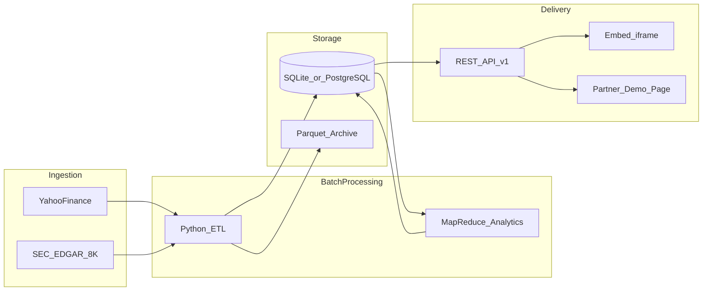

# DAT Radar Architecture Overview

DAT Radar is a B2B data product that exposes MSTR mNAV analytics through an API and embeddable iframe widget.

## End-to-end data flow

## Components

- `pipeline/`: scheduled ETL, holdings ingestion, mNAV computation, map-reduce style analytics
- `storage/schema.sql`: relational schema for prices, holdings, mNAV daily rows, API keys
- `dat-radar/app/api/v1/mnav/[ticker]/route.ts`: partner-facing API endpoint
- `dat-radar/app/embed/[ticker]/page.tsx`: iframe-safe chart widget
- `dat-radar/app/demo/page.tsx`: integration guide for partner developers

## Scaling notes

- 10x scale: move from SQLite to managed PostgreSQL (Neon/Supabase), add read replicas
- 100x scale: Spark batch on parquet lake, pre-aggregate tiles for embed workloads, add cache/CDN
