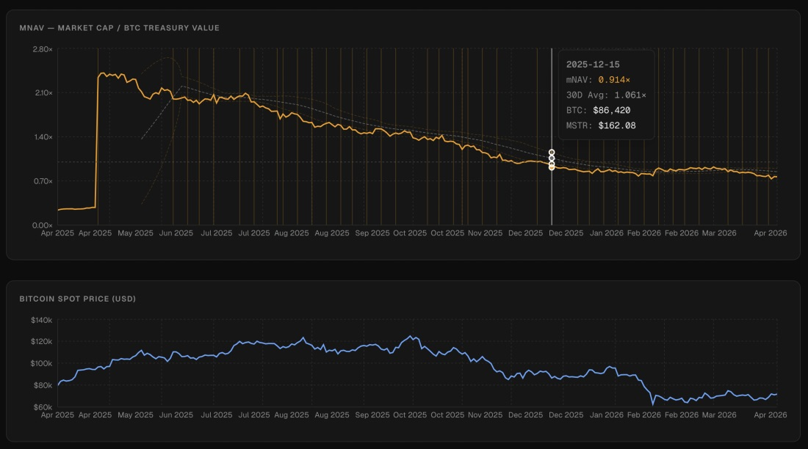
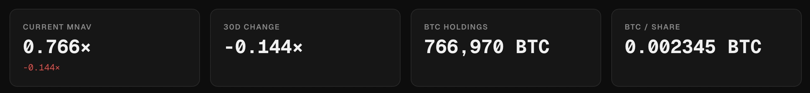
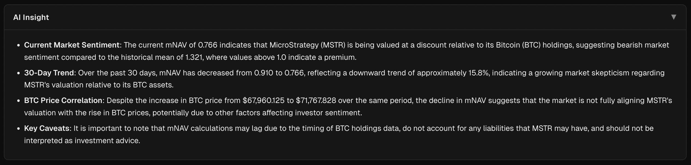
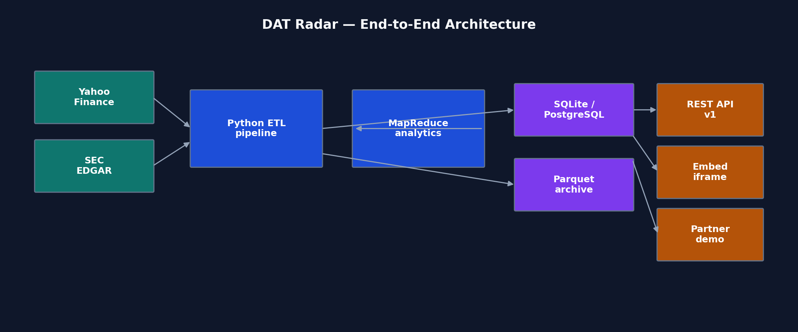
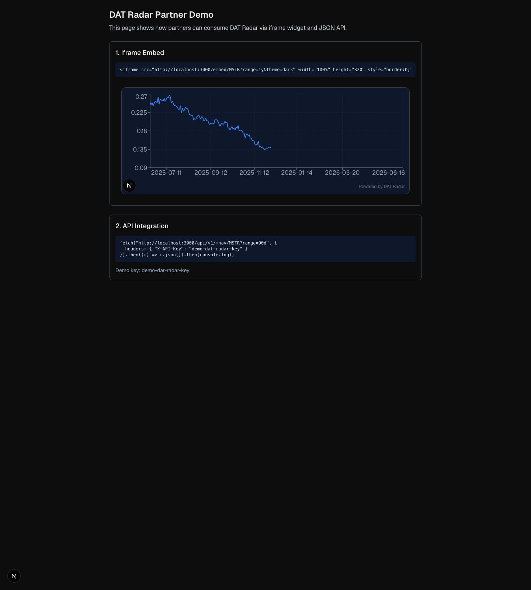
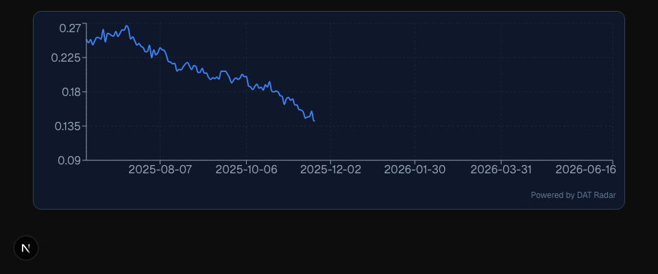

# GitHub Repository and Demo

- GitHub: https://github.com/ruby0322/dat-radar-embed
- Live app: https://dat-radar-embed.vercel.app/
- Embed demo: https://dat-radar-embed.vercel.app/demo

# System Overview

DAT Radar extends the HW2 mNAV dashboard into a **B2B data product**. Partners can consume the same treasury analytics through a JSON API or embed a lightweight iframe chart in their own apps and media pages.

## Dashboard and charts

- **mNAV time series** with a 30-day rolling mean, a ±1 standard deviation band, and a horizontal reference at **1×**
- **BTC spot (USD)** on the same calendar axis for side-by-side comparison
- **Disclosure markers** on dates when new 8-K–based BTC holdings are applied

## KPIs and controls

## AI insight

The operator dashboard also supports optional narrative insight generated from pre-computed statistics when `OPENAI_API_KEY` is configured.

# Target Customer

DAT Radar targets **small-to-mid crypto product teams** (3 to 20 people), especially:

- FinTech backend engineers integrating market widgets
- Product managers of crypto media sites who publish treasury analytics
- Independent research tool builders who need reliable DAT.co metrics

Their current workaround is usually one of:

1. Manual spreadsheets updated from SEC filings
2. In-house scripts that break whenever filing format changes
3. Screenshots of third-party charts with weak reproducibility

DAT Radar is a better wedge because it removes the highest-friction engineering task: robust SEC holdings extraction and mNAV calculation.

# Evidence of Demand and Willingness to Pay

## Evidence collection process

To avoid speculative claims, we created reproducible scripts and raw artifacts:

- `scripts/collect_demand_evidence.py`
- `docs/demand-evidence/raw/competitor_pricing.csv`
- `docs/demand-evidence/raw/hn_signal.csv`
- `docs/demand-evidence/raw/reddit_signal.csv`

Methodology is documented in:

- `docs/demand-evidence/methodology.md`
- `docs/demand-evidence/competitor-pricing.md`

## Key evidence

1. **Competitor pricing anchors exist** for both API and insight products (e.g., Finnhub, Messari, TradingView widgets).
2. **Community signal exists** around Bitcoin treasury and MSTR valuation topics.
3. **Operational pain is concrete**: maintaining SEC parsers is brittle and costly.

## Willingness-to-pay estimate

If maintaining an in-house parser takes roughly 40 to 80 engineer-hours over a quarter, a subscription around $99/month can be economically justified for teams that ship treasury-focused content or dashboards.

Proposed tiers:

- Free: one ticker, watermark, 1k req/day
- Pro: $99/mo, up to five tickers, higher limits, optional watermark removal
- Enterprise: custom SLA, bulk historical exports

# Technical System Design

## Data sources

- Yahoo Finance for MSTR and BTC-USD daily prices
- SEC EDGAR 8-K filings for BTC holdings disclosures
- Local static holdings baseline for robust fallback

## Ingestion and storage

- Python ETL pipeline (`pipeline/`) runs:
  - `ingest_prices.py`
  - `ingest_holdings.py`
  - `compute_mnav.py`
  - `analytics_mapreduce.py`
- Relational storage in SQLite/PostgreSQL schema (`storage/schema.sql`)
- Parquet archives for reproducible data artifacts

## Processing

For each trading day:

1. Join MSTR and BTC prices
2. Forward-fill holdings using the latest filing at or before date
3. Compute market cap, treasury value, BTC/share, mNAV
4. Compute rolling mNAV statistics and BTC realized volatility

A map-reduce style analytics script computes cross-series correlation metrics in parallel using Python multiprocessing.

## Delivery

- Dashboard endpoint: `/api/market-data` (DB-first, live fallback)
- B2B API endpoint: `/api/v1/mnav/[ticker]` with API key
- Embed endpoint: `/embed/[ticker]` (iframe-ready)
- Integration demo: `/demo`

## Architecture diagram

The end-to-end architecture follows four stages:

1. **Ingestion:** Yahoo Finance (MSTR/BTC prices) and SEC EDGAR (8-K holdings)
2. **Batch processing:** Python ETL (`ingest_*`, `compute_mnav`) and MapReduce-style analytics
3. **Storage:** SQLite/PostgreSQL for serving + Parquet archives for reproducibility
4. **Delivery:** REST API (`/api/v1/mnav`), embed iframe (`/embed/MSTR`), and partner demo page (`/demo`)

A machine-readable mermaid version is maintained in `docs/architecture.md`.

## Partner integration demo

The `/demo` page documents how partners integrate DAT Radar with a copy-paste iframe snippet and a sample `fetch()` call against the versioned API (`X-API-Key` header).

## Embeddable widget

The embed route renders a compact mNAV chart suitable for third-party pages. Free-tier partners see a "Powered by DAT Radar" watermark; API keys enforce per-minute rate limits.

# Go-to-Market Difficulties

1. **Trust and adoption**: teams must trust accuracy of parsed holdings.
2. **Data-source policy risk**: external API changes can break ingestion.
3. **Cold start**: only one ticker (MSTR) is useful but narrow.
4. **Competition**: incumbents can bundle similar metrics with broader suites.
5. **Unit economics**: low-priced plans must still cover infra and maintenance.

Mitigations include transparent methodology docs, data lineage logs, and migration path to managed Postgres + scheduled ETL.

# Reproducibility and Deliverables Checklist

- Source code repo with ingestion, processing, and delivery code
- README with local run + ETL instructions
- Demand-evidence scripts and raw outputs
- Architecture document and report
- Optional deployment URL for grading convenience
